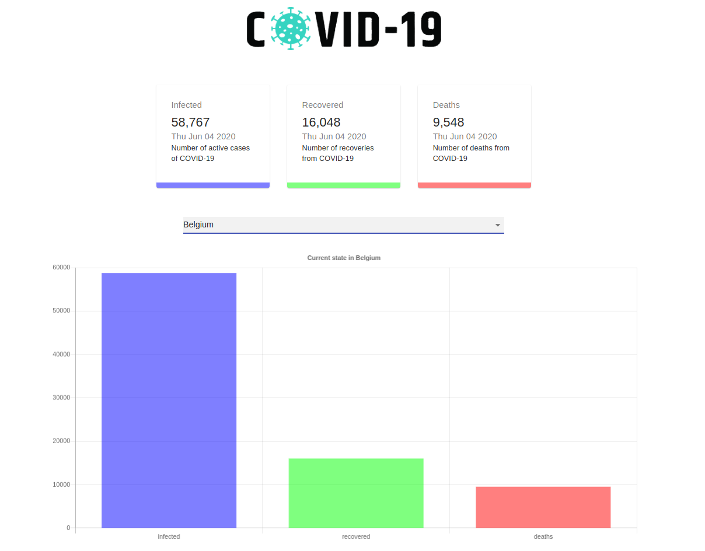

This project was bootstrapped with [Create React App](https://github.com/facebook/create-react-app).

# Coronapp
Application to track coronavirus information with charts from a public api 
https://covid19.mathdro.id/api

Link to the app [here](https://azorzini.github.io/coronapp/) 

## Tech used

- [React](https://github.com/facebook/react)
- [Axios](https://github.com/axios/axios)
- [Material ui](https://material-ui.com/)
- [React chartjs 2](https://github.com/jerairrest/react-chartjs-2)
- [styled-components](https://github.com/styled-components/styled-components)
- [GH Pages](https://github.com/marketplace/actions/deploy-to-github-pages)

## Images

